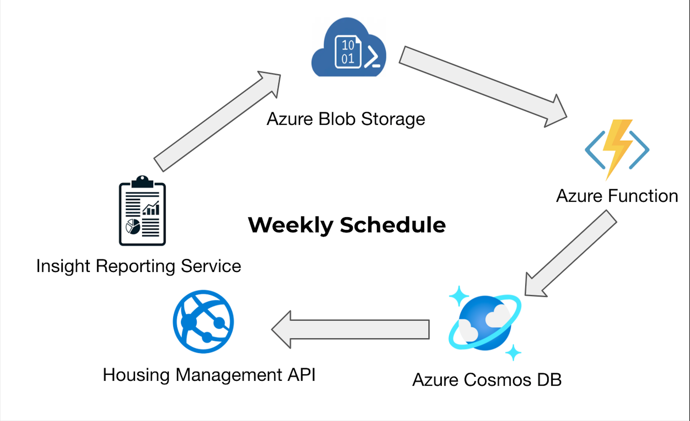

# Address Ingestion

A limitation of using Capita's SOAP web services is that we can't filter the address data as part of the request.

Since we're interested in tenant, leaseholder and communal area address data, we've implemented an approach to use insight reports to query the capita data and generate CSVs specific to the address data we want. The CSV would then be ingested to get the data into our cosmos DB for the API to query.

## Process

- Generate CSVs containing specific address information using insights reports.
- CSVs would be generated periodically to keep the address data up-to-date.
- Upload the CSVs into an Azure BLOB storage container using an Azure job.
- Read the data from the CSV and write it into a container in the CosmosDB.
- Address information can then be queried by the Housing Management API.

### Reading the data (using Azure function)

We created a [C# function](https://github.com/Newarkandsherwood/HousingRepairsOnline.AddressIngestion) that would read the address data within a CSV file stored in the Azure BLOB container and then insert that data into the appropriate container in our Cosmos database.

Three CSV files would be generated. One each for tenant addresses, communal areas and leasehold addresses.

The C# code is deployed as an Azure function that would integrate with the storage container and CosmosDB.

